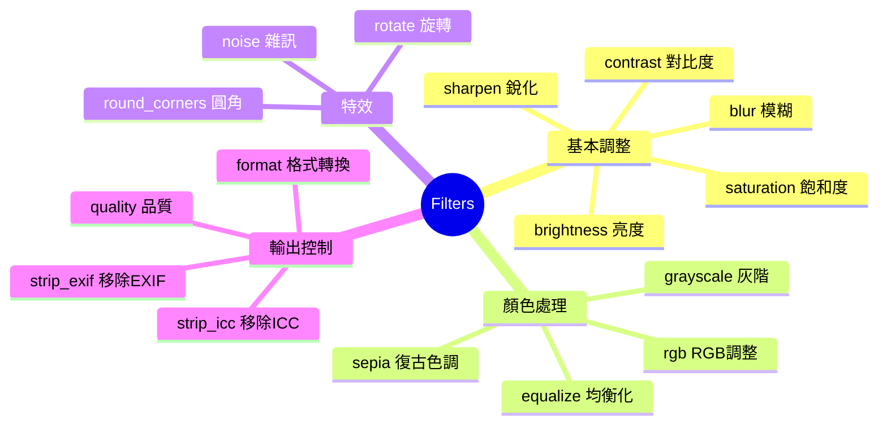
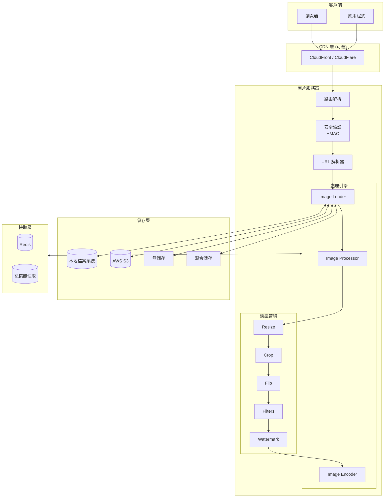
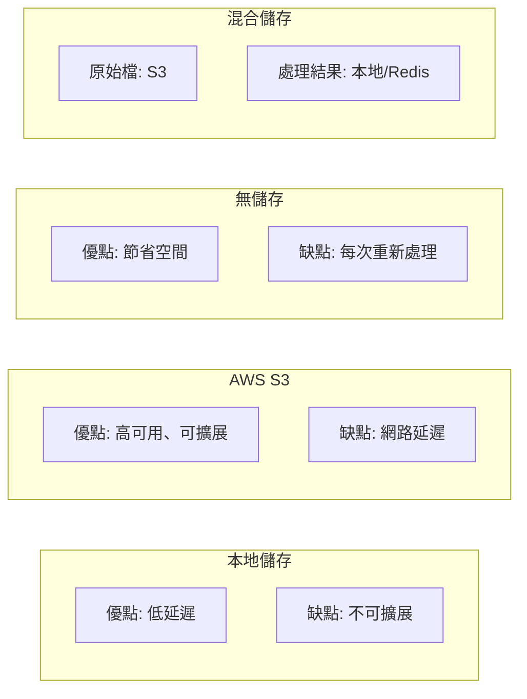
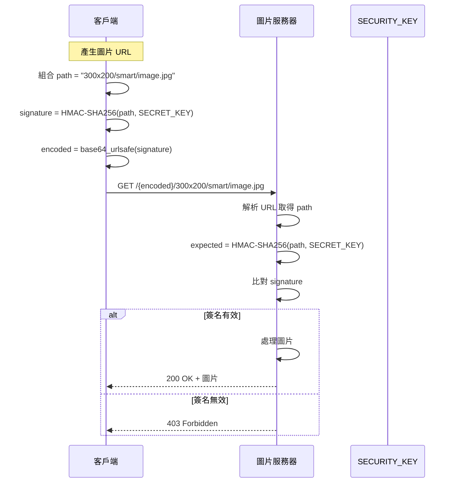
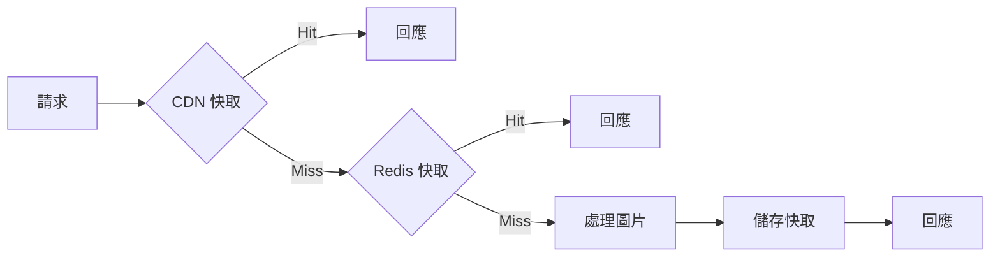

# 圖片處理服務器 (Image Processing Server) 架構規劃

## 專案概述

建立一個高效能、可擴展的圖片處理服務器，參考 [Thumbor](https://github.com/thumbor/thumbor) 的設計理念，使用 **Golang** 開發。此服務支援即時圖片處理（resize、crop、flip、filters、watermark），並提供多種儲存後端選項與完整的安全機制。

---

## 核心功能

### 1. 圖片處理功能

| 功能 | 說明 | URL 參數範例 |
| --- | --- | --- |
| **Resize** | 調整圖片尺寸（等比例縮放或指定尺寸） | `/300x200/` 或 `/300x0/`（自動計算高度） |
| **Crop** | 裁切圖片（支援手動座標或智慧裁切） | `/10x20:100x150/` |
| **Flip** | 水平/垂直翻轉圖片 | `/-300x200/`（水平）或 `/300x-200/`（垂直） |
| **Filters** | 套用濾鏡效果（blur、grayscale、brightness 等） | `/filters:blur(7):grayscale()/` |
| **Watermark** | 加入浮水印（支援文字或圖片） | `/filters:watermark(logo.png,10,10,50)/` |

### 2. 支援的濾鏡列表



### 3. 支援的圖片格式

| 格式 | 讀取 | 寫入 | 色深 | HDR | 優先級 | 備註 |
| --- | :---: | :---: | :---: | :---: | :---: | --- |
| **JPEG** | ✅ | ✅ | 8-bit | ❌ | 必要 | 最常用格式，相容性最高 |
| **PNG** | ✅ | ✅ | 16-bit | ❌ | 必要 | 支援透明，無損壓縮 |
| **WebP** | ✅ | ✅ | 8-bit | ❌ | 必要 | Google 開發，壓縮率比 JPEG 高 30% |
| **AVIF** | ✅ | ✅ | 12-bit | ✅ | ⭐ 推薦 | **2024 主流新格式**，壓縮率比 JPEG 高 50%，瀏覽器全面支援 |
| **JPEG XL** | ✅ | ✅ | 32-bit | ✅ | ⭐ 推薦 | **未來趨勢**，可無損轉換 JPEG，Safari 17+ 支援 |
| **GIF** | ✅ | ✅ | 8-bit | ❌ | 必要 | 支援動畫 GIF |
| **BMP** | ✅ | ✅ | 24-bit | ❌ | 可選 | 傳統格式，無壓縮 |
| **TIFF** | ✅ | ✅ | 16-bit | ❌ | 可選 | 專業用途，高品質格式 |
| **HEIC** | ✅ | ❌ | 16-bit | ✅ | 可選 | Apple 格式，需轉換輸出，有授權問題 |
| **SVG** | ✅ | ❌ | N/A | N/A | 可選 | 向量圖，需轉換為點陣圖輸出 |

> [!TIP]
**格式選擇建議**：

- 通用網頁用途 → **WebP** 或 **AVIF**
- 追求最高壓縮率 → **AVIF**
- 需要 HDR 或專業用途 → **JPEG XL**
- 最大相容性 → **JPEG**

---

## 系統架構

### 整體架構圖



### 專案目錄結構

```bash
images-Filters/
├── cmd/
│   └── server/
│       └── main.go                 # 應用程式入口 (Composition Root)
├── internal/
│   ├── api/                        # HTTP 處理器 (Handler / Controller)
│   │   ├── handler.go              # 圖片處理 Handler
│   │   ├── middleware.go           # 中介層（Auth/CORS/Tracing/Metrics）
│   │   └── response.go             # 統一回應格式 (DTO / Response)
│   ├── service/                    # 業務邏輯層 (Usecase / Application Layer)
│   │   ├── interface.go            # Service 介面定義
│   │   └── image_service.go        # 圖片處理業務邏輯
│   ├── config/
│   │   └── config.go               # 設定管理（Viper）
│   ├── processor/                  # 圖片處理核心
│   │   ├── processor.go            # 處理器主邏輯
│   │   ├── resize.go               # Resize 實作
│   │   ├── crop.go                 # Crop 實作
│   │   ├── flip.go                 # Flip 實作
│   │   └── encoder.go              # 編碼器
│   ├── filter/                     # 濾鏡管線
│   │   ├── interface.go            # 濾鏡介面
│   │   ├── blur.go                 # 模糊濾鏡
│   │   ├── brightness.go           # 亮度濾鏡
│   │   ├── contrast.go             # 對比度濾鏡
│   │   ├── grayscale.go            # 灰階濾鏡
│   │   ├── watermark.go            # 浮水印
│   │   └── ...                     # 其他濾鏡
│   ├── loader/                     # 圖片載入器
│   │   ├── interface.go            # Loader 介面
│   │   ├── http_loader.go          # HTTP 載入器
│   │   └── file_loader.go          # 檔案載入器
│   ├── storage/                    # 儲存層 (Infrastructure Adapter)
│   │   ├── interface.go            # Storage 介面
│   │   ├── local.go                # 本地儲存
│   │   ├── s3.go                   # AWS S3 儲存
│   │   ├── no_storage.go           # 無儲存
│   │   └── mixed.go                # 混合儲存
│   ├── security/                   # 安全機制
│   │   ├── hmac.go                 # HMAC 簽名驗證
│   │   └── url_signer.go           # URL 簽名工具
│   ├── parser/                     # URL 解析
│   │   └── url_parser.go           # URL 解析器
│   └── cache/                      # 快取層
│       ├── interface.go            # Cache 介面
│       ├── redis.go                # Redis 快取
│       └── memory.go               # 記憶體快取
├── pkg/                            # 共用工具與基礎設施
│   ├── imaging/
│   │   └── imaging.go              # 圖片處理工具封裝
│   └── utils/
│       └── utils.go                # 通用工具
├── config/                         # 設定檔
│   ├── config.yaml                 # 設定檔模板
│   └── config.example.yaml         # 設定檔範例
├── routes/                         # 路由定義層
│   └── routes.go                   # HTTP Endpoint 定義
├── docs/                           # 設計與使用者文件
│   ├── architecture.md             # 系統架構說明
│   ├── api.md                      # API 規格文件
│   └── adr/                        # ADR (設計決策紀錄)
├── deploy/                         # 部署設定
│   ├── kustomize/                  # Kustomize 設定
│   │   ├── base/                   # 基礎資源
│   │   └── overlays/               # 環境覆蓋 (dev/staging/prod)
│   └── docker/                     # Docker 相關
│       └── docker-compose.yaml     # Docker Compose
├── charts/                         # Helm Charts
│   └── images-filters/             # 主 Helm Chart
├── Makefile
├── Dockerfile
├── .golangci.yml                   # Linter 設定
├── go.mod
├── go.sum
└── README.md                       # 專案說明（含 Badges）
```

---

## URL 格式設計

### 安全 URL 格式

```bash
http://<server>/<signature>/<options>/<filters>/<image_path>
```

### 不安全 URL 格式（開發用）

```bash
http://<server>/unsafe/<options>/<filters>/<image_path>
```

### URL 參數說明

| 參數 | 說明 | 範例 |
| --- | --- | --- |
| `signature` | HMAC-SHA256 簽名（28 字元） | `K97LekICOXT9MbO3X1u8BBkrjbu5` |
| `options` | 尺寸與裁切選項 | `300x200`, `fit-in/300x200`, `-300x200` |
| `filters` | 濾鏡鏈 | `filters:blur(7):grayscale()` |
| `image_path` | 原始圖片路徑或 URL | `path/to/image.jpg` 或 URL encoded |

### URL 範例

```bash
# 基本縮放
http://localhost:8080/unsafe/300x200/https%3A%2F%2Fexample.com%2Fimage.jpg

# 智慧裁切 + 濾鏡
http://localhost:8080/unsafe/300x200/smart/filters:grayscale():blur(5)/https%3A%2F%2Fexample.com%2Fimage.jpg

# Fit-in 模式（不裁切，保持比例）
http://localhost:8080/unsafe/fit-in/300x200/https%3A%2F%2Fexample.com%2Fimage.jpg

# 翻轉 + 浮水印
http://localhost:8080/unsafe/-300x200/filters:watermark(logo.png,10,10,50)/https%3A%2F%2Fexample.com%2Fimage.jpg
```

---

## 儲存策略

### 儲存模式比較



### 儲存介面設計

```go
// Storage 介面定義
type Storage interface {
    // 取得圖片
    Get(ctx context.Context, key string) ([]byte, error)

    // 儲存圖片
    Put(ctx context.Context, key string, data []byte) error

    // 檢查是否存在
    Exists(ctx context.Context, key string) (bool, error)

    // 刪除圖片
    Delete(ctx context.Context, key string) error
}
```

---

## 安全機制

### HMAC 簽名流程



### 安全設定

```yaml
security:
  # 啟用安全模式
  enabled: true

  # 安全金鑰（生產環境必須設定）
  security_key: "your-super-secret-key-here"

  # 允許 unsafe URL（僅開發環境）
  allow_unsafe: false

  # 允許的圖片來源網域（白名單）
  allowed_sources:
    - "example.com"
    - "cdn.example.com"
    - "*.example.com"

  # 最大尺寸限制
  max_width: 4096
  max_height: 4096
```

---

## 設定檔結構

```yaml
# config/config.yaml

server:
  host: "0.0.0.0"
  port: 8080
  read_timeout: 30s
  write_timeout: 30s
  max_request_size: 10MB

# 圖片處理設定
processing:
  # 預設品質
  default_quality: 85
  # 最大處理尺寸
  max_width: 4096
  max_height: 4096
  # 處理 worker 數量
  workers: 4
  # 預設輸出格式
  default_format: "jpeg"

# 安全設定
security:
  enabled: true
  security_key: "${SECURITY_KEY}"
  allow_unsafe: false
  allowed_sources: []

# 儲存設定
storage:
  # 類型: local, s3, no_storage, mixed
  type: "local"

  local:
    root_path: "/data/images"

  s3:
    bucket: "my-images-bucket"
    region: "ap-northeast-1"
    access_key: "${AWS_ACCESS_KEY}"
    secret_key: "${AWS_SECRET_KEY}"

  mixed:
    source_storage: "s3"
    result_storage: "local"

# 快取設定
cache:
  enabled: true
  type: "redis"  # redis, memory

  redis:
    host: "localhost"
    port: 6379
    password: ""
    db: 0

  memory:
    max_size: "512MB"
    ttl: 3600

# 日誌設定
logging:
  level: "info"
  format: "json"
  output: "stdout"
```

---

## 技術選型

### 核心依賴

| 套件 | 用途 | 說明 |
| --- | --- | --- |
| `github.com/gin-gonic/gin` | Web 框架 | 高效能 HTTP 路由 |
| `github.com/spf13/viper` | 設定管理 | 支援 YAML、環境變數 |
| `github.com/vincent119/zlogger` | 日誌 | 高效能結構化日誌 |
| `github.com/vincent119/commons` | 工具庫 | 通用工具函式庫 |
| `go.uber.org/fx` | 依賴注入 | Uber 開源 DI 框架 |
| `github.com/swaggo/swag` | Swagger | API 文件自動生成 |
| `github.com/swaggo/gin-swagger` | Swagger UI | Gin 整合 Swagger UI |
| `github.com/prometheus/client_golang` | Prometheus | 指標監控 |
| `github.com/disintegration/imaging` | 圖片處理 | Resize、Crop、Flip 等 |
| `golang.org/x/image` | 圖片格式支援 | WebP、TIFF 等 |
| `github.com/chai2010/webp` | WebP 支援 | 完整 WebP 編解碼 |
| `github.com/gen2brain/avif` | **AVIF 支援** | AVIF 編解碼（純 Go 實作） |
| `github.com/ArtificialLegacy/go-jxl` | **JPEG XL 支援** | JXL 編解碼（需 CGO） |
| `github.com/jdeng/goheif` | HEIC 支援 | Apple HEIC 格式解碼 |
| `github.com/srwiley/oksvg` | SVG 支援 | SVG 渲染 |
| `github.com/aws/aws-sdk-go-v2` | AWS S3 | S3 儲存支援 |
| `github.com/redis/go-redis/v9` | Redis | 快取支援 |

---

## 效能優化策略

### 1. 多層快取



### 2. Worker Pool

- 使用 goroutine pool 處理圖片
- 限制同時處理數量，避免記憶體爆炸
- 支援優雅關閉

### 3. 串流處理

- 大圖片使用串流讀取/寫入
- 避免一次載入整張圖片到記憶體

---

## API 端點

| 方法 | 路徑 | 說明 |
| ---- | ---- | ---- |
| GET | `/<signature>/<options>/<filters>/<image>` | 處理圖片（安全模式） |
| GET | `/unsafe/<options>/<filters>/<image>` | 處理圖片（不安全模式） |
| GET | `/healthz` | 健康檢查 |
| GET | `/metrics` | Prometheus 指標 |

---

## 開發階段規劃

### Phase 1: 核心功能 (MVP)

- [ ] 專案初始化與基本架構
- [ ] URL 解析器
- [ ] Resize 功能
- [ ] Crop 功能
- [ ] Flip 功能
- [ ] 本地儲存
- [ ] 基本 HTTP 載入器

### Phase 2: 濾鏡與浮水印

- [ ] 濾鏡管線架構
- [ ] Blur 濾鏡
- [ ] Grayscale 濾鏡
- [ ] Brightness/Contrast 濾鏡
- [ ] 浮水印功能

### Phase 3: 安全與儲存

- [ ] HMAC 簽名驗證
- [ ] URL 簽名工具庫
- [ ] AWS S3 儲存
- [ ] 混合儲存模式
- [ ] 來源白名單

### Phase 4: 效能優化

- [ ] Redis 快取
- [ ] Worker Pool
- [ ] 串流處理
- [ ] 指標監控

### Phase 5: 進階功能與新格式支援

- [ ] 更多濾鏡（sepia、noise、sharpen 等）
- [ ] 圖片格式轉換優化
- [ ] **AVIF 格式支援**（編碼/解碼）
- [ ] **JPEG XL 格式支援**（編碼/解碼）
- [ ] HEIC 格式解碼
- [ ] SVG 渲染支援
- [ ] 智慧裁切（基於臉部偵測）
- [ ] 自動格式選擇（根據瀏覽器 Accept header）

---

## Phase 7: 圖片上傳 API

### 7.1 上傳功能實作

- [ ] 擴充 `internal/service/interface.go` 加入 `UploadImage`
  - [ ] Input: `io.Reader`, filename, contentType
  - [ ] Output: `savedPath`, `signedURL`, error
- [ ] 實作 `internal/service/image_service.go` 的上傳邏輯
  - [ ] 使用 `PutStream` 儲存檔案
  - [ ] 產生 HMAC 簽名 URL (針對原始圖片路徑)
- [ ] 擴充 `internal/api/handler.go` 加入 `HandleUpload`
  - [ ] 處理 `multipart/form-data`
  - [ ] 驗證檔案類型與大小
- [ ] 實作上傳安全中介層
  - [ ] 驗證 `Authorization: Bearer <SecurityKey>`
- [ ] 更新 `routes/routes.go` 註冊 `POST /upload` (套用安全中介層)
- [ ] 回傳 JSON: `{"url": "<signed_url>", "path": "<saved_path>"}`

### 7.2 驗證與測試

- [ ] 撰寫上傳功能單元測試 (Mock Storage/Service)
- [ ] 手動測試上傳 API (`curl -H "Authorization: Bearer ..." -F "file=@..."`)
- [ ] 驗證回傳的 Signed URL 是否可訪問

---

## User Review Required

> [!IMPORTANT]
> 請確認以下設計決策是否符合你的需求：

1. **技術選型**：使用 Gin 作為 Web 框架，是否有其他偏好？ -Gin
2. **儲存優先順序**：預設使用本地儲存還是 S3？ - 預設本地儲存
3. **安全模式**：開發環境是否需要預設開啟 `unsafe` 模式？
4. **快取策略**：是否需要 CDN 整合？ - Yes
5. **是否需要 Docker 部署支援**？   -Yes
6. **是否需要 Kubernetes 部署設定**？ - Yes kustomize and Helm chart

---

## 驗證計畫

### 自動化測試

```bash
# 執行所有測試
go test ./...

# 執行測試並顯示覆蓋率
go test -cover ./...
```

### 手動驗證

1. 啟動服務器，測試基本 resize 功能
2. 測試各種濾鏡效果
3. 測試 HMAC 簽名驗證
4. 測試不同儲存後端
5. 壓力測試驗證效能

---

## 參考資料

- [Thumbor 官方文件](https://thumbor.readthedocs.io/)
- [Thumbor GitHub](https://github.com/thumbor/thumbor)
- [Go imaging 套件](https://github.com/disintegration/imaging)

---

## Phase 8: 隱形浮水印 (Blind Watermark)

### 8.1 設定與自動化

- 更新 Config 結構支援 `BlindWatermark` (`internal/config/config.go`)
- 更新 `image_service.go` 自動套用浮水印邏輯

### 8.2 核心算法實作

- 實作 DCT/IDCT 變換 (`internal/filter/blind_watermark.go`)
- 實作文字轉二進位編碼邏輯
- 實作頻域嵌入邏輯
- 註冊 `blind_watermark` 濾鏡
- 撰寫單元測試

### 8.3 浮水印檢測服務

- 建立 `WatermarkService` 介面 (`internal/service/watermark_service.go`)
- 實作 `DetectWatermark` 方法（從 io.Reader 檢測）
- 實作浮水印提取與比對邏輯
- 建立 `WatermarkHandler` (`internal/api/watermark_handler.go`)
- 實作 `HandleDetect` API 端點
- 註冊 `/detect` 路由（含認證中介層）
- 實作 fx 依賴注入整合

### 8.4 支援路徑檢測

- 修改 `WatermarkService` 以支援從 Storage 讀取檔案
- API `/detect` 接口新增 `path` 參數，允許傳入如 `uploads/2025/12/26/...` 的路徑
- 流程：若未上傳檔案但提供了有效路徑，Server 將直接從儲存層讀取圖片進行檢測
- 更新 Swagger 註解
- 撰寫單元測試
