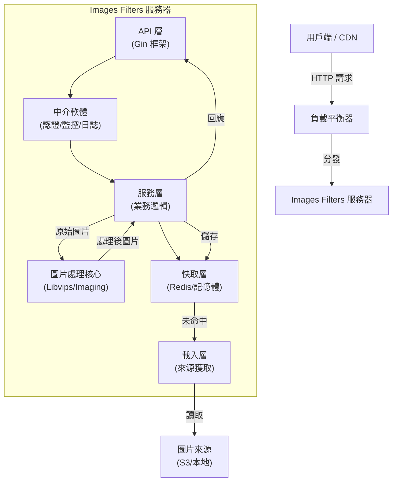

# System Architecture

[English](../architecture.md)

## 系統架構圖

Images Filters 採用分層架構設計，旨在實現高並發處理與易於擴充性。

### 元件職責

#### 1. API 層 (`internal/api`)

- 使用 Gin 框架處理 HTTP 請求與回應。
- 負責請求參數驗證與路由分發。
- 作為外部流量的統一入口。

#### 2. 服務層 (`internal/service`)

- 編排圖片處理的工作流程。
- 協調快取 (Cache)、載入器 (Loader) 與處理器 (Processor) 之間的互動。
- 實作核心邏輯：「檢查快取 -> 載入圖片 -> 進行處理 -> 寫入快取」。

#### 3. 圖片處理核心 (`internal/processor`)

- 圖片操作的引擎核心。
- 封裝 `disintegration/imaging` 或 `libvips` 等底層函式庫。
- 處理縮放 (Resize)、裁切 (Crop)、濾鏡應用與格式轉換。

#### 4. 載入層 (`internal/loader`)

- 負責從不同來源獲取原始圖片。
- 支援多種後端：本地檔案系統、AWS S3、HTTP 遠端 URL。

#### 5. 快取層 (`internal/cache`)

- 儲存處理後的結果以降低重複運算負載。
- 支援多級快取：記憶體快取 (Local Memory) 與分散式快取 (Redis)。

#### 6. 安全層 (`internal/security`)

- 驗證 URL 的 HMAC 簽名，確保請求合法。
- 防止未經授權的資源消耗與 DoS 攻擊。

### 資料流向

1. **請求進入**：請求到達 API 端點。
2. **安全檢查**：中介軟體驗證簽名（若啟用安全模式）。
3. **快取查詢**：服務層檢查快取中是否已有處理好的圖片。
   - **命中**：直接回傳快取內容。
4. **圖片載入**：若未命中，載入層從來源 (Source) 讀取原始圖片。
5. **圖片處理**：處理器解碼圖片，套用操作（縮放、濾鏡），並編碼為目標格式。
6. **寫入快取**：處理結果被寫入快取，供未來請求使用。
7. **回應傳輸**：將處理好的圖片串流回傳給用戶端。
